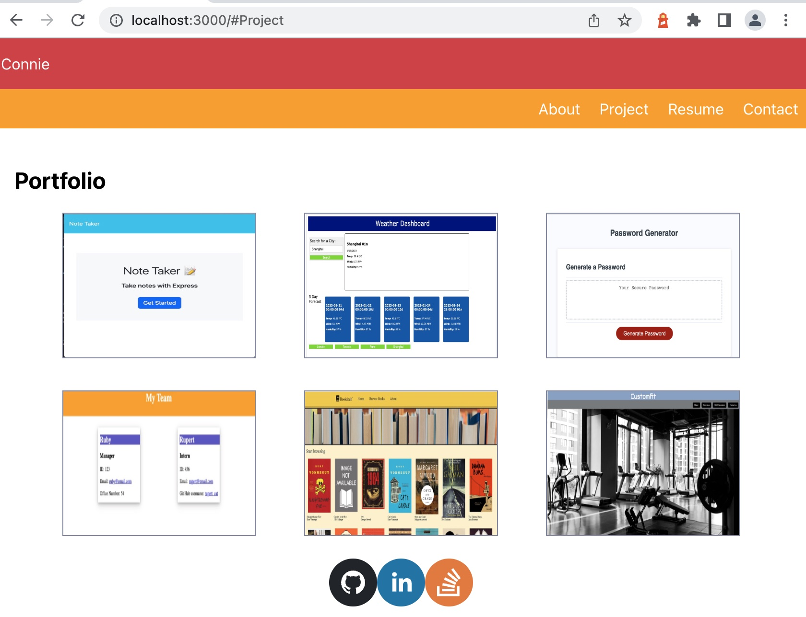

# react portfolio

Link to GitHub Pages Deployed site: [/]()

## Description

This is a portfolio application to share my projects with both prospective employers, clients and other developers. By showvcasing my work, it can lead to potential future collaborations and projects.

## Installation

This is a single page application using React. The application is deployed using GitHub Pages.

## Preview & Usage

1. To run the build, npm run start to connect to a localhost.
2. In the folder structure, you will find components and pages - using React allows for efficiency and optimization as any edits that need to be made - it will only render those sections.
3. Future application is to connect the backend or API - to save messages from contact us page.

## License

There were no licenses obtained for this project. For more information on licenses, follow this link:
[https://choosealicense.com/](https://choosealicense.com/).
